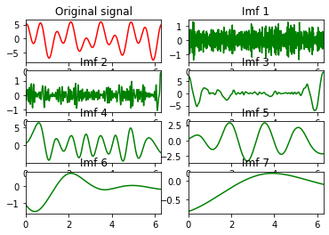
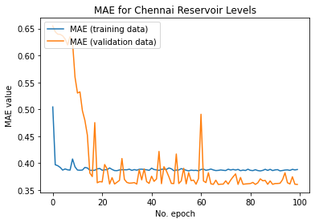
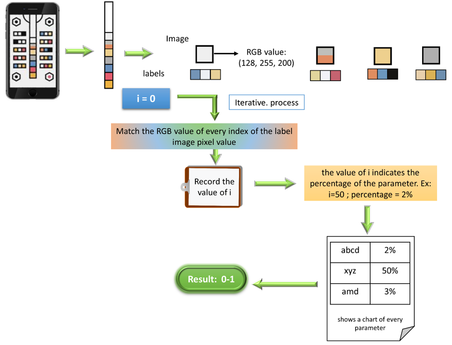

<h1>TeamMeena</h1>
The project demonstration is included in <a href = "https://drive.google.com/file/d/181gUBDEMz58IHIHHx7jw6MJlwbkMgj6l/view?usp=sharing">Video in the google drive</a>

<i>We were unable to upload the video in the github repository because of the size limitation</i>

The repository contains the project <a href="implemented_codes"> implemented codes </a>, <a href="Report_team_Meena.pdf"> the final report </a>

<ul>
<li><a href = "implemented_codes/EDA.ipynb">EDA</a> - all sort of data vidualization and signal feature check</li>
<li><a href = "implemented_codes/Data_Imbalancing_handeling.ipynb">Data Imbalancing handle</a> - Augmentation method Linear Sampling implemented and balanced the term pretermm class</li>
<li><a href = "implemented_codes/Train_on_our_proposed_Model.ipynb">Training on our proposed model</a> - based on our proposed model gerneralised training and estimate the accuracy values</li>
</ul>

We have proposed an app which can keep and show health records of a woman throughout her pregnency period. Mainly we have discussed two methods that will be diagnosed which defines whether the baby is term and preterm

<ul>
  <li>Uterine Contraction analysis</li>
  <li>Urinanalysis</li>
  </ul>
<h2>Uterine Contraction Analysis</h2>

We can get the diagnosis of the term/preterm staage of pregnancy by only providing the MMG signal. As we have used supervised neural network, We have pretrained our model using the <a href="https://archive.physionet.org/physiobank/database/tpehgdb/">The Term-Preterm EHG Database (TPEHG DB)</a>

<i>We were unable to sync the dataset inside the repo, so we provided the dataset link</i>

 

In this dataset, we are having 12 channel signals as input

We then focused on to do some feature analysis such as EMD

Training Matrixes

Demo Prediction

<h2>Urinanalysis</h2>

the proposed method for urinanalysis using AI

